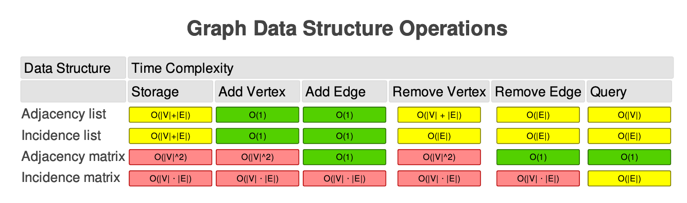

# Graphs

## Overview 
- Graphs in computer science are nothing like graphs used in mathematics to represent data. Graphs in CS are a non-linear data structure that consist of a set of vertices and edges. Vertices or nodes, act like the nodes in trees, and they are connected by the edges.

- ### Directed vs. Undirected
    - In a directed graph structure, the edges have directions. This means that node X can have an edge that points to node Y, which means you can traverse from X to Y. But that doesn't mean you can traverse Y to X unless there is another edge directed from Y to X. In an undirected graph structure, an edge between nodes goes both ways every time.

- ### Weighted Graphs
    - The edges contain data, typically the length of the edge. This is particularly useful in building nav/gps applications. Nodes model buildings or points of interest and edges model the distance.

- ### Cycle
    - A node that points to itself.

- ### Graph Operations
1. addNode
2. removeNode
3. addEdge
4. removeEdge
5. contains
6. isEmpty
7. size
8. merge
9. BFS
10. DFS

## Representations of a Graph in Javascript
- ### Adjacency Matrix
    - Create one column and one row for every node
    - When two nodes have an edge, add a one to the point they intersect

    

    - It is fast to look up a specific edge or to create a new edge in an Adjacency Matrix
    - However it takes quadratic space and takes quadratic time to insert a node into the graph

- ### Adjacency List
    - Start with a collection of items, and each item represents each unique node in the graph.
    - Each item in the collection will have an associated array that contains a list of it's connections"
    - This makes it faster to iterate over a node's edges, and it makes it more space efficient especially in a situation with many nodes and few connections.

    

- ### Big O Complexity of Graph Operations
